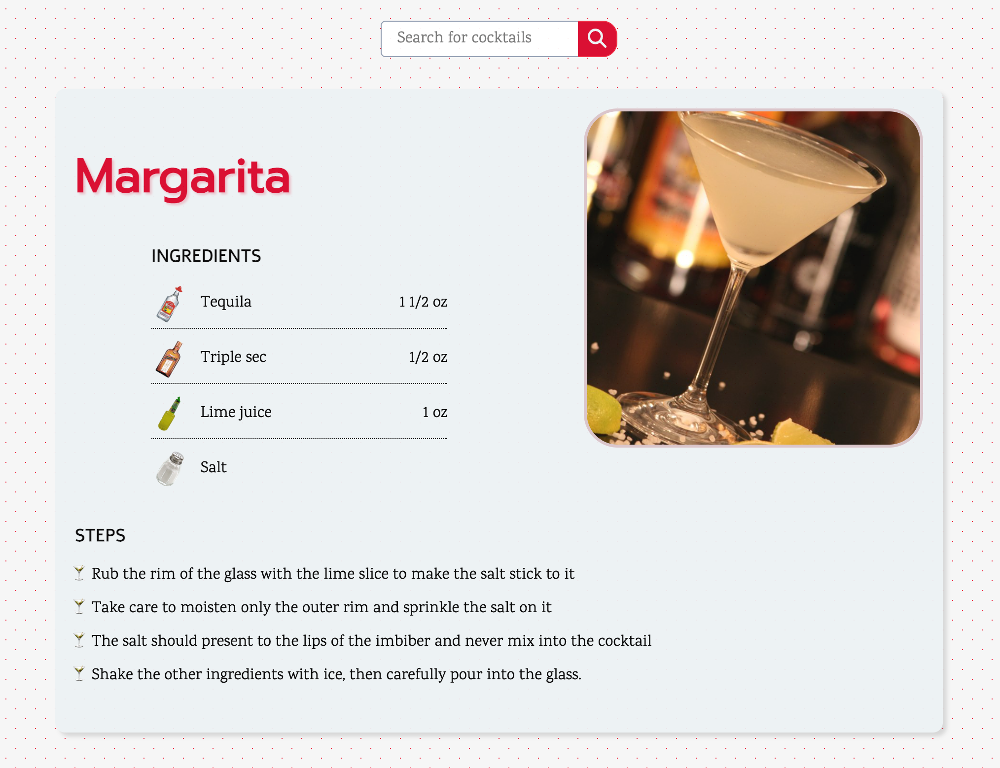

# 

[🍸🍸🍸 **GET YOUR COCKTAIL RECIPES HERE** 🍸🍸🍸](https://volkanungan.github.io/cocktails/)

#### A cocktail recipe application that I developed to practice:

    🟨 Consuming third party APIs
    🟧 React
    🟧 Flexbox and grid
    🟦 Create React App
    🟩 React Router
    ⬜️ React Query

It is responsive.

### To-do:

- Add search suggestions with throttling
- Make it accessible
- Add tests

It consumes the free API provided by [TheCocktailDB](https://www.thecocktaildb.com/api.php).
